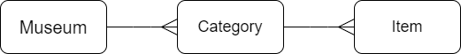
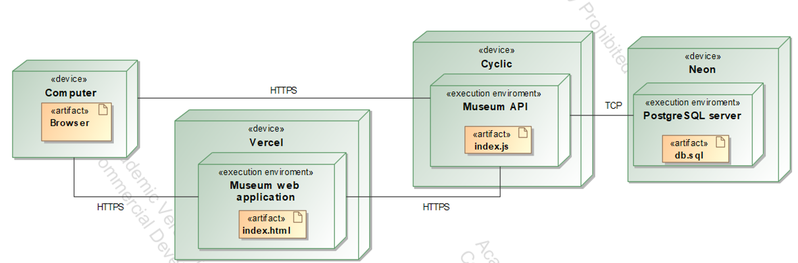

# Museum app
This is an app that helps to structure items in a museum and information about them.

## Getting started
Clone repository:
```sh
git clone https://github.com/Zeptosec/Museum.git
```
Rename *.env.example* file to *.env* in *museumback* folder and fill it out with correct information.  
Install all dependencies for backend:
```sh
cd museum/museumback
npm install
```
Install all dependencies for frontend:
```sh
cd museum/museumfront
npm install
```
Start backend in development:
```sh
cd museum/museumback
npm run dev
```
Start frontend in development:
```sh
cd museum/museumfront
npm run dev
```

## Purpose
To let visitor read about the museum and it's items on the internet.
The platform is made of two parts: frontend, where users can view the page with nicely formatted data, and backend where data can be modified or fetched from database and served to user using API. 

## Functional requirements
1. Admin can:
    1. Manage curators.
    2. Manage categories.
    3. Manage items.
2. Curators can:
    1. Manage items in categories assigned to them.
3. Guests can:
    1. Preview item details.
    2. Preview category details.
    3. Preview museum details.
    4. Register
    5. Login

## Domain


## Deployment diagram

